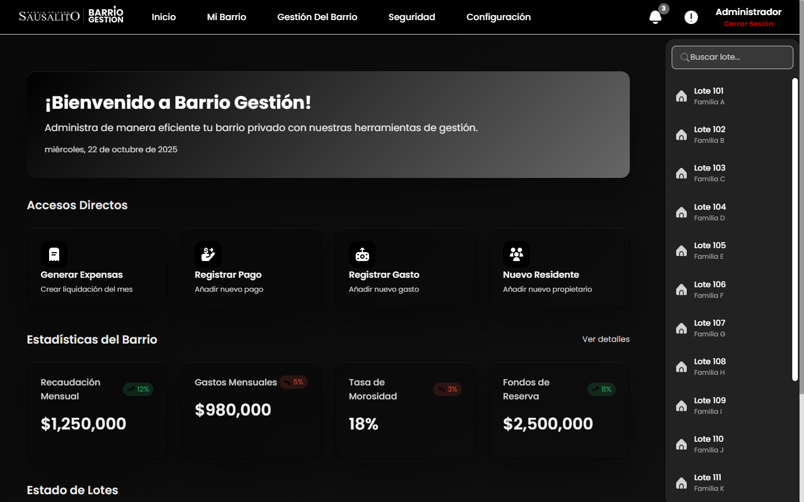
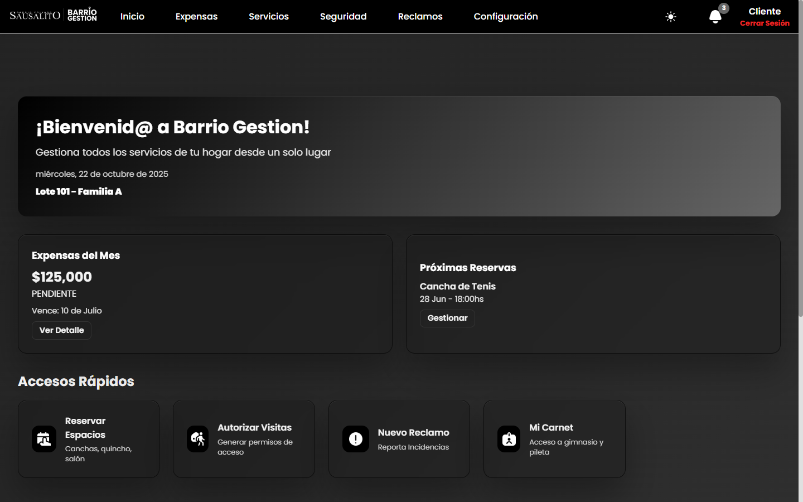
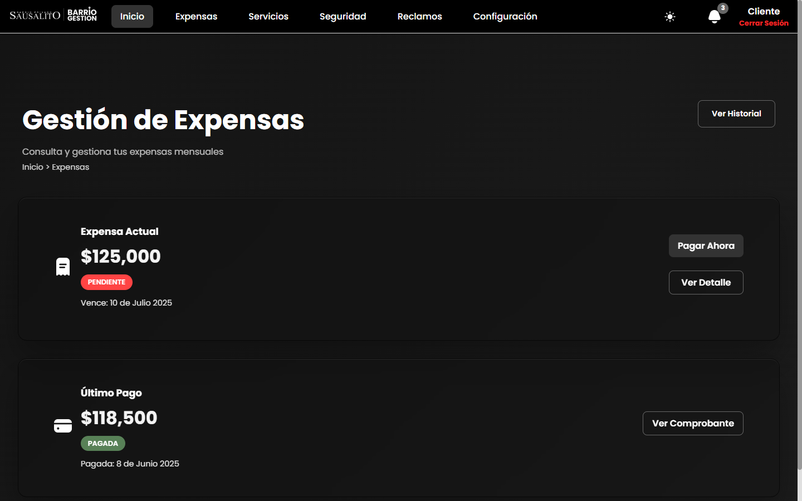
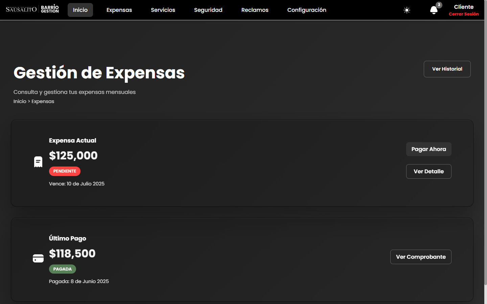

# BarrioGestion - Frontend


## Descripción

**BarrioGestion** es un sistema web diseñado para gestionar de manera centralizada las operaciones de barrios cerrados y countrys. La plataforma permite automatizar procesos administrativos, supervisar alertas y garantizar que cada usuario acceda solo a las funciones que le corresponden, optimizando la eficiencia y organización de la comunidad.

Tras una investigación realizada por nuestro equipo, identificamos que los barrios cerrados enfrentan dificultades debido a la falta de herramientas adecuadas en las aplicaciones y sitios web disponibles. BarrioGestion surge como solución integral a esta problemática.

---

## Características Principales

### Para Administradores
- **Gestión de Residentes**: Control completo de usuarios, lotes y permisos
- **Control Financiero**: Administración de expensas, pagos, ingresos y gastos
- **Gestión de Fondos**: Seguimiento de fondos comunes y presupuestos
- **Control de Accesos**: Historial y gestión de accesos al barrio
- **Sistema de Reclamos**: Gestión centralizada de quejas y solicitudes
- **Reservas de Espacios**: Administración de espacios comunes
- **Notificaciones**: Envío de comunicados a residentes
- **Generación de Carnets**: Creación de carnets digitales para residentes

### Para Residentes (Clientes)
- **Consulta de Expensas**: Visualización y pago de expensas
- **Historial de Pagos**: Acceso a historial completo de transacciones
- **Sistema de Reclamos**: Creación y seguimiento de reclamos
- **Reserva de Espacios**: Reserva de amenities (quincho, piscina, canchas, etc.)
- **Gestión de Visitas**: Registro y control de invitados
- **Mi Carnet Digital**: Acceso a carnet digital personal
- **Mapa del Barrio**: Visualización del plano del barrio
- **Notificaciones**: Recepción de comunicados importantes

---

## Stack Tecnológico

- **Frontend**: HTML5, CSS3, JavaScript (Vanilla)
- **Backend**: Node.js con Prisma ORM
- **Arquitectura**: Multi-página (MPA - Multi Page Application)
- **Patrón**: Organización modular por roles (Admin/Cliente)

---

## Estructura del Proyecto

```
BarrioGestion/
│
├── index.html              # Landing page principal
├── script.js               # Scripts generales
├── style.css               # Estilos globales
├── README.md
│
└── app/
    ├── login.html          # Página de inicio de sesión
    ├── login.js
    ├── login.css
    ├── settings.json       # Configuraciones de la aplicación
    │
    ├── assets/             # Recursos compartidos
    │   ├── icons/          # Iconos SVG y PNG
    │   ├── img/            # Imágenes generales
    │   └── js/             # Scripts compartidos
    │
    ├── config/
    │   └── languages/
    │       └── es_AR.json  # Archivo de internacionalización
    │
    ├── dashboard/
    │   ├── Admin/          # Panel de administración
    │   │   ├── index.php
    │   │   ├── assets/     # Recursos del admin
    │   │   ├── includes/   # Componentes reutilizables
    │   │   └── modules/    # Módulos funcionales
    │   │       ├── complains/          # Gestión de reclamos
    │   │       ├── Configuracion/      # Configuración del sistema
    │   │       ├── Gestion/            # Gestión general
    │   │       │   ├── carnet/         # Generación de carnets
    │   │       │   ├── espacios/       # Gestión de espacios
    │   │       │   ├── lotes/          # Gestión de lotes
    │   │       │   └── usuarios/       # Gestión de usuarios
    │   │       ├── MiBarrio/           # Gestión financiera
    │   │       │   ├── expensas/       # Administración de expensas
    │   │       │   ├── fondos/         # Gestión de fondos
    │   │       │   ├── gastos/         # Registro de gastos
    │   │       │   ├── ingresos/       # Registro de ingresos
    │   │       │   └── pagos/          # Gestión de pagos
    │   │       ├── notifications/       # Sistema de notificaciones
    │   │       └── Seguridad/          # Control de seguridad
    │   │           ├── GestionAccesos/ # Gestión de accesos
    │   │           └── Historial/      # Historial de accesos
    │   │
    │   └── Cliente/        # Panel de residentes
    │       ├── index.php
    │       ├── Assets/     # Recursos del cliente
    │       ├── includes/   # Componentes reutilizables
    │       └── modules/    # Módulos funcionales
    │           ├── Configuracion/       # Configuración de cuenta
    │           ├── Expensas/            # Consulta de expensas
    │           │   ├── Historial/       # Historial de expensas
    │           │   └── PagarExpensas/   # Pago de expensas
    │           ├── Notificaciones/      # Visualización de notificaciones
    │           ├── Reclamos/            # Sistema de reclamos
    │           ├── Seguridad/           # Gestión de accesos
    │           │   ├── ControlAccesos/  # Control de invitados
    │           │   ├── GesPermisos/     # Gestión de permisos
    │           │   └── RegistroVisitas/ # Registro de visitas
    │           └── Servicios/           # Servicios adicionales
    │               ├── MapaDelBarrio/   # Mapa interactivo
    │               ├── MiCarnet/        # Carnet digital
    │               └── ReservasEC/      # Reservas de espacios
    │
    ├── register/           # Registro de nuevos usuarios
    │   ├── register.html
    │   └── register.css
    │
    └── Utils/              # Utilidades
        ├── logout.js
        └── auth/
            └── validator.php
```

---

## Integración con Backend

La aplicación consume una API REST desarrollada con **Node.js** y **Prisma ORM**. La autenticación se maneja mediante tokens JWT almacenados en cookies HTTP-only para mayor seguridad.

### Autenticación

El sistema utiliza JWT con refresh tokens almacenados en cookies HTTP-only. El flujo es el siguiente:

1. El usuario envía credenciales a `/auth/login`
2. El backend valida y genera un `refreshToken` en cookies
3. Las peticiones subsecuentes incluyen automáticamente el token
4. El token se valida en cada request mediante `/auth/validator`
5. Al cerrar sesión, el token se elimina de las cookies

### Módulos Principales

El frontend consume endpoints organizados en módulos:

- **Autenticación**: Login, registro, cambio de contraseña y validación de sesión
- **Expensas**: Consulta, historial y detalles de expensas
- **Reclamos**: Creación y seguimiento de tickets
- **Invitados**: Gestión completa de visitantes
- **Reservas**: Consulta de espacios y creación de reservas
- **Servicios**: Generación de carnets digitales

> **Para documentación completa de la API**, endpoints detallados y ejemplos, consultar el [README del Backend](../backend/README.md).

---

## Roles y Permisos

### Administrador
Acceso completo al sistema con capacidad de:
- Gestionar usuarios y lotes
- Administrar finanzas del barrio
- Configurar espacios comunes
- Revisar y gestionar reclamos
- Generar reportes
- Controlar accesos y seguridad

### Residente (Cliente)
Acceso limitado a funciones personales:
- Ver y pagar expensas
- Crear reclamos
- Reservar espacios comunes
- Gestionar invitados
- Consultar notificaciones
- Descargar carnet digital

---

## Convenciones de Código

### Estructura de Archivos
Cada módulo sigue la estructura:

```
NombreModulo/
├── NombreModulo.php    # Lógica y HTML
├── NombreModulo.css    # Estilos específicos
└── NombreModulo.js     # Funcionalidad JavaScript
```

### Nomenclatura
- **Archivos**: PascalCase para módulos (ej: `GesPermisos.php`)
- **CSS**: kebab-case para clases (ej: `.user-card`)
- **JavaScript**: camelCase para funciones (ej: `loadUserData()`)

---

## Capturas de Pantalla

### Panel de Administración



### Panel de Residente


### Gestión de Expensas



### Servicio de MiCarnet



---

## Roadmap

### En Desarrollo
- [ ] **Escalabilidad para municipios**: Adaptación del sistema para gestionar no solo barrios privados sino todo tipo de comunidades con necesidades organizacionales similares
- [ ] **Mapa del barrio interactivo avanzado**: Visualización interactiva con ubicación de lotes, espacios comunes, zonas de servicios y puntos de interés
- [ ] **Listado de empleos y servicios locales**: Marketplace interno para ofrecer y contratar servicios (plomería, jardinería, limpieza, etc.)
- [ ] **Integración con pasarelas de pago**: MercadoPago, PayPal y tarjetas de crédito para pagos online

### Inteligencia Artificial
- [ ] **Predicción de Gastos**: Análisis predictivo de gastos mensuales basado en históricos para mejorar la planificación presupuestaria
- [ ] **Detección de Anomalías Financieras**: Sistema de alertas automáticas para identificar patrones inusuales en pagos, gastos o ingresos
- [ ] **Dashboard Predictivo**: Visualización de tendencias y proyecciones financieras con gráficos interactivos generados por IA

### Futuras Mejoras
- [ ] **Aplicación móvil nativa**: Apps para iOS y Android con funcionalidades offline
- [ ] **Sistema de mensajería interna**: Chat en tiempo real entre residentes y administración
- [ ] **Gestión de obras y reformas**: Control de proyectos de construcción y mantenimiento con seguimiento de estado, presupuestos y cronogramas

---

## Licencia

Este proyecto es propiedad de BarrioGestion. Todos los derechos reservados.

---

## Contacto

**Equipo BarrioGestion**
- Email: Bytercodex@gmail.com
- Sitio Web: [panchosrv.bringfeel.com.ar/tesisde/](https://panchosrv.bringfeel.com.ar/tesisde/)

---

## Agradecimientos

Agradecemos a todas las comunidades y barrios cerrados que participaron en nuestra investigación inicial y nos ayudaron a identificar las necesidades reales del sector.

---

**Versión**: 1.0.0  
**Última actualización**: Octubre 2025